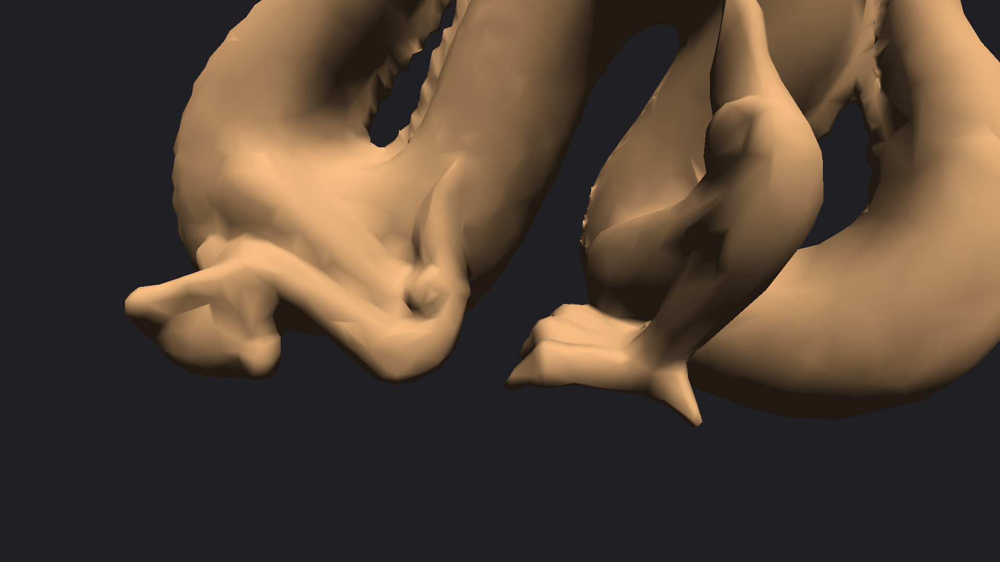
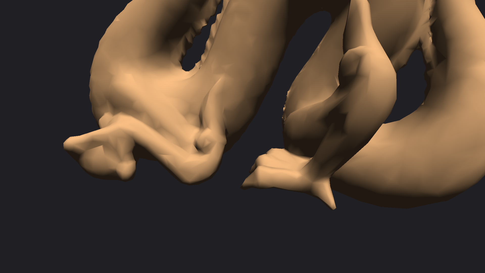
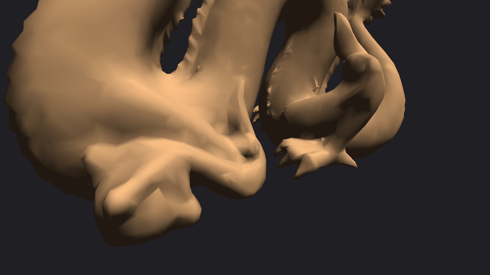
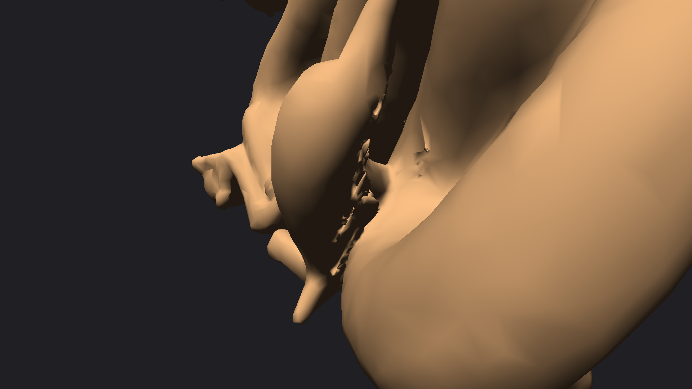

## TD OpenGL — Préparation au projet (binôme)

**Étudiant(s)** : Aymeric LETELLIER, Allan SEDDI  
**Cours** : Computer graphics  
**Devoir** : “TD OpenGL - préparation au projet”  
**Date** : (à compléter)

## 1) Résumé (ce qui est rendu)
L’objectif demandé est d’afficher un objet 3D avec une **caméra orbitale** et une **matrice de vue** calculée par une fonction `LookAt` recréée (sans utiliser `gluLookAt`).  

Ce rendu contient :
- Un affichage du **Stanford Dragon** (maillage fourni dans `DragonData.h`).
- Une caméra orbitale contrôlée à la souris / molette.
- Une **view matrix** \(V\) calculée par `LookAt(eye, target, up)`.
- Le passage de \(V\) au **vertex shader** et son application **à la position uniquement**.
- Une **normal matrix** \(N\) dérivée de la matrice monde \(M\) afin de transformer correctement les normales.
- Des captures d’écran illustrant le résultat et la caméra orbitale.

## 2) Cahier des charges (rappel de l’énoncé)
### Obligatoire
- Afficher un objet 3D avec une caméra orbitale.
- Recréer une fonction `LookAt` qui génère une **view matrix**.
- Passer la view matrix au vertex shader et l’appliquer **avant la projection** (sur la position seulement).
- Idéalement : passer une matrice spécifique pour les normales (ou réutiliser la world matrix).

### Optionnel
TP05 : correction gamma + illumination ambiante hémisphérique (non fait dans ce rendu).

## 3) Organisation du code (simple, niveau 4A)
Le code est volontairement minimal (pas de framework, pas de “grosse” architecture) et **tout est regroupé dans un seul fichier** :
- `main.cpp` : création fenêtre + boucle de rendu + input + caméra orbitale + `LookAt` + normal matrix + création VAO/VBO/EBO pour dessiner le dragon
- `shaders/project.vs.glsl` / `shaders/project.fs.glsl` : shaders (inchangés)

## 3.1 Remarques perso (choix + galères rencontrées)
- **Choix “simple”** : on a gardé un éclairage très basique (diffuse + un peu d’ambient). L’idée était surtout d’avoir un rendu lisible et de vérifier que les normales sont OK.
- **Mac / VAO** : sur macOS, on a eu un crash au début avec les VAO. On a dû utiliser les fonctions `glGenVertexArraysAPPLE / glBindVertexArrayAPPLE` (extension Apple) au lieu de `glGenVertexArrays` classique.
- **UV pas utilisées** : `DragonData.h` fournit aussi des UV, mais comme ce n’était pas obligatoire pour ce rendu, on n’a pas fait de texturing.

## 3.2 Traçabilité (TP → preuve)
Pour montrer qu’on a bien fait les TPs avant, et que le rendu final en réutilise les étapes, on a ajouté un dossier :
- `traces/00_README_traces.md` (index)

Puis, pour chaque TP/TD important, un petit fichier qui dit :
1) quel PDF c’était,
2) ce qu’on a repris,
3) où ça se voit dans le code.

Liste :
- `traces/01_TD_pipeline_VBO_IBO_VAO.md`
- `traces/02_TP02_rendu3D_perspective_depth_culling_dragon.md`
- `traces/03_TP_transformations_MVP_uniforms.md`
- `traces/04_TP_illumination_diffuse_ambient_normals.md`
- `traces/05_Devoir_preparation_projet_orbit_lookat_normalmatrix.md`

## 4) Données du modèle (Stanford Dragon)
Le fichier `DragonData.h` fournit :
- `DragonVertices[]` : tableau interleavé de **8 floats par vertex**
  - Position : \(X,Y,Z\)
  - Normale : \(N_x,N_y,N_z\)
  - Texture coords : \(U,V\)
- `DragonIndices[]` : indices (type `uint16_t`) pour dessiner la surface par triangles.

Dans ce rendu (obligatoire), on utilise :
- la **position** et la **normale** (UV non exploitées car pas de texturing demandé en obligatoire).

## 5) Pipeline de transformations (modèle → monde → vue → clip)
### 5.1 Espaces de coordonnées
- **Model space** : coordonnées du maillage tel qu’il est fourni (dragon).
- **World space** : coordonnées après la transformation monde \(M\) (positionnement/rotation dans la scène).
- **View space** : coordonnées après transformation vue \(V\) (caméra).
- **Clip space** : coordonnées après projection \(P\) (perspective).

### 5.2 Formule utilisée
Dans le vertex shader, la position est transformée par :
\[
\text{clipPos} = P \cdot V \cdot M \cdot \begin{bmatrix}x\\y\\z\\1\end{bmatrix}
\]

Remarque importante : l’énoncé demande explicitement que la view matrix soit appliquée **à la position**, avant projection.

### 5.3 Convention OpenGL (colonne-major) et ordre des produits
On s’est calé sur la convention OpenGL : matrices en **colonne-major** et vecteurs colonnes. On applique les transformations sous la forme :
\[
P \cdot V \cdot M \cdot p
\]
où \(p\) est un vecteur colonne (4x1).  

Conséquences :
- L’ordre d’écriture \(P·V·M\) est l’ordre d’application effectif (d’abord \(M\), puis \(V\), puis \(P\)).
- En C/C++ côté CPU, quand on remplit un tableau `float m[16]`, les coefficients doivent correspondre à cette convention.

### 5.4 Projection perspective (rappel rapide)
On utilise une projection perspective classique définie par :
- un angle vertical \(fovy\)
- un aspect ratio \(aspect = width/height\)
- un plan proche \(near\) et un plan lointain \(far\)

La matrice de perspective utilisée correspond à la forme standard OpenGL :
\[
P =
\begin{bmatrix}
\frac{f}{aspect} & 0 & 0 & 0\\
0 & f & 0 & 0\\
0 & 0 & \frac{far+near}{near-far} & -1\\
0 & 0 & \frac{2·far·near}{near-far} & 0
\end{bmatrix}
\quad \text{avec } f = \frac{1}{\tan(\frac{fovy}{2})}
\]

Dans ce rendu, \(fovy \approx 60°\), \(near = 0.1\), \(far = 100\).

## 6) Caméra orbitale (yaw/pitch/distance)
### 6.1 Paramètres
- `target` : point regardé (centre d’orbite)
- `distance` : rayon de l’orbite (zoom)
- `yaw` : rotation autour de l’axe vertical \(Y\)
- `pitch` : rotation verticale (haut/bas), **clampée** pour éviter le retournement

### 6.2 Calcul de la position caméra
On part d’un repère sphérique autour de `target` :
\[
\text{eye} = \text{target} + \begin{bmatrix}
d \cdot \cos(pitch)\cdot \sin(yaw)\\
d \cdot \sin(pitch)\\
d \cdot \cos(pitch)\cdot \cos(yaw)
\end{bmatrix}
\]

Ensuite on construit \(V\) avec `LookAt(eye, target, up)`.

### 6.3 Contrôles (input)
- **Souris (drag)** : modifie `yaw` et `pitch` (sensibilité simple).
- **Molette** : modifie `distance` avec clamp `minDistance / maxDistance`.

## 7) LookAt → construction de la view matrix
### 7.1 Entrées / sortie
- Entrées : `eye`, `target`, `up`
- Sortie : matrice \(V\) (4x4) qui transforme **world → view**

### 7.2 Base caméra (axes orthonormés)
On construit une base caméra à partir de 3 vecteurs :
- \(f\) (“forward”) : direction de visée
  \[
  f = \text{normalize}(target - eye)
  \]
- \(s\) (“side/right”) : axe droite
  \[
  s = \text{normalize}(f \times up)
  \]
- \(u\) (“up recalculé”) :
  \[
  u = s \times f
  \]

### 7.3 Assemblage matrice + translation
En pratique, on remplit une matrice 4x4 avec les axes de la caméra, puis on ajoute la translation :
- rotation : colonnes = \(s, u, -f\)
- translation : \(-s\cdot eye\), \(-u\cdot eye\), \(f\cdot eye\)

Ça correspond au comportement d’un `gluLookAt` “classique” (main droite).

### 7.4 Mini-extrait de code (LookAt)
L’implémentation est volontairement courte et lisible :
- normalisation des vecteurs
- produits vectoriels
- remplissage de la matrice en colonne-major

(Voir fichier : `src/Math.hpp`.)

## 8) Normales et normal matrix
### 8.1 Pourquoi une matrice dédiée ?
Une normale est un vecteur directionnel. Si on applique une transformation monde qui comporte du **scale non uniforme** ou du cisaillement, appliquer directement \(M\) à une normale donne un résultat incorrect.

### 8.2 Formule correcte
La formule “propre” (celle qu’on trouve partout) est :
\[
N = \text{transpose}\left(\text{inverse}(\text{mat3}(M))\right)
\]
Puis dans le shader :
- `v_Normal = normalize(u_NormalMatrix * a_Normal);`

### 8.3 Contrainte de l’énoncé : pas de view sur les normales
On n’applique pas \(V\) aux normales :
- l’éclairage est calculé en world space (ou dans un espace cohérent),
- et l’énoncé demande explicitement de ne pas appliquer la view aux normales.

Dans ce rendu, \(N\) est calculée uniquement depuis la matrice monde \(M\).

### 8.4 “Preuve” pratique (comment vérifier)
Un test simple pour vérifier que les normales sont cohérentes :
- on met une lumière directionnelle fixe (par ex. \((0.2, 0.9, 0.4)\)),
- on fait tourner uniquement \(M\) (rotation Y) : les zones éclairées doivent tourner de manière stable et “logique”.

Si les normales étaient mal transformées, on observerait typiquement :
- des zones lumineuses qui “glissent” de manière incohérente,
- des artefacts ou un éclairage qui ne suit pas la rotation de l’objet.

## 9) Shaders (explication)
### 9.1 Vertex shader
Rôle :
- transformer la position \(P·V·M·pos\)
- transformer la normale via `u_NormalMatrix` (liée à \(M\))

### 9.2 Fragment shader
Rôle :
- afficher un éclairage simple pour “voir” les normales :
  - diffuse (Lambert) + ambiante

Ce n’est pas le TP illumination complet : c’est volontairement minimal pour valider la géométrie et les normales.

### 9.3 Pourquoi cet éclairage “minimal” est suffisant pour le devoir
L’énoncé ne demande pas un modèle d’illumination avancé. L’éclairage minimal sert ici à :
- rendre la 3D lisible,
- démontrer que les normales sont bien utilisées (donc normal matrix OK),
- montrer visuellement la rotation + caméra orbitale.

## 10) Résultats (captures d’écran)
### Vue générale


### Caméra orbitale (angle 1)


### Caméra orbitale (angle 2)


### Zoom


## 11) Tests / validation (check-list)
- [x] Un objet 3D est affiché (dragon).
- [x] La caméra est orbitale (angles différents visibles sur les captures).
- [x] La view matrix est produite par `LookAt` (implémentée dans `src/Math.hpp`).
- [x] Le vertex shader applique \(V\) avant \(P\) sur la **position**.
- [x] Les normales utilisent une matrice dédiée \(N\) et ne reçoivent pas \(V\).

### 11.1 Correspondance explicite “énoncé → preuve dans le rendu”
- **“Afficher un objet 3D”** : visible dans les captures (section 10).
- **“Caméra orbitale”** : angles `02_orbit_left` et `03_orbit_right` (section 10) + explication section 6.
- **“LookAt recréé”** : dérivation section 7 + implémentation `src/Math.hpp`.
- **“View matrix appliquée au vertex shader avant projection”** : formule section 5 + shader `project.vs.glsl`.
- **“Pas de view sur les normales”** : expliqué section 8.3 + normal matrix dépend de \(M\) uniquement.

## 12) Limites et améliorations possibles
- Ajouter le texturing (UV déjà présentes) et implémenter l’optionnel TP05 (gamma + hémisphérique).
- Ajouter un mode fil de fer pour mieux visualiser la topologie.
- Ajouter un contrôle de la lumière (rotation, intensité) pour mieux démontrer l’éclairage.

## Annexe A — Build / exécution (environnement)
### Dépendances
Ce projet utilise :
- GLFW (fenêtre + input)
- GLEW (chargement des fonctions OpenGL)
- OpenGL (framework macOS)

### Compilation (exemple macOS)
Le build exact dépend de l’installation locale des libs. Un exemple (similaire à celui utilisé pour produire les captures) :

```bash
clang++ -std=c++17 -O2 \
  -I"/Users/aymeric/libs/glfw/include" \
  -I"/opt/homebrew/include" \
  -I"/Users/aymeric/Downloads/Computer graphics" \
  -I"/Users/aymeric/Downloads/Computer graphics/common" \
  main.cpp "../../common/GLShader.cpp" \
  -L"/Users/aymeric/libs/glfw/lib-arm64" -L"/opt/homebrew/lib" \
  -lglfw3 -lGLEW \
  -framework OpenGL -framework Cocoa -framework IOKit -framework CoreVideo \
  -o PreparationAuProjet
```

### Exécution
- Mode normal (interaction souris/molette) :

```bash
./PreparationAuProjet
```

