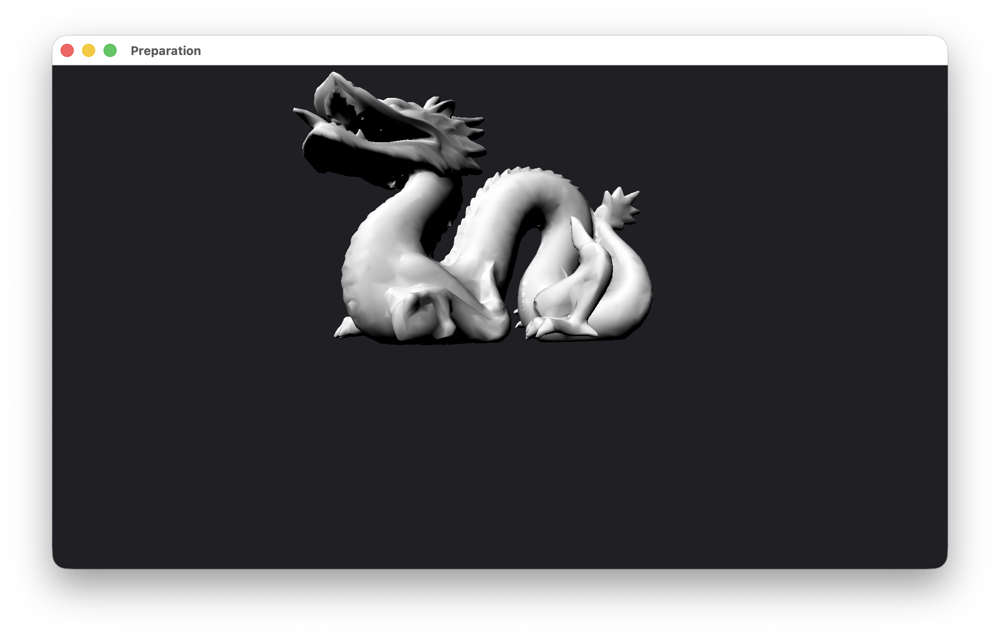
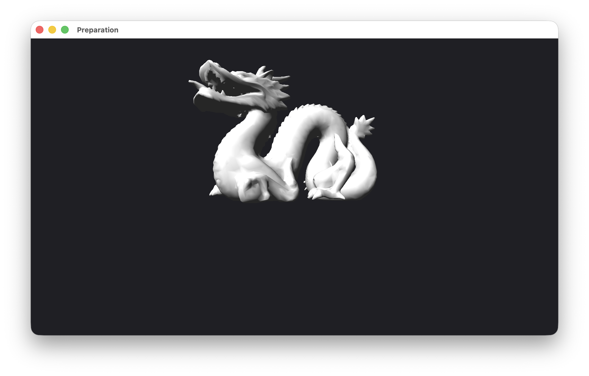
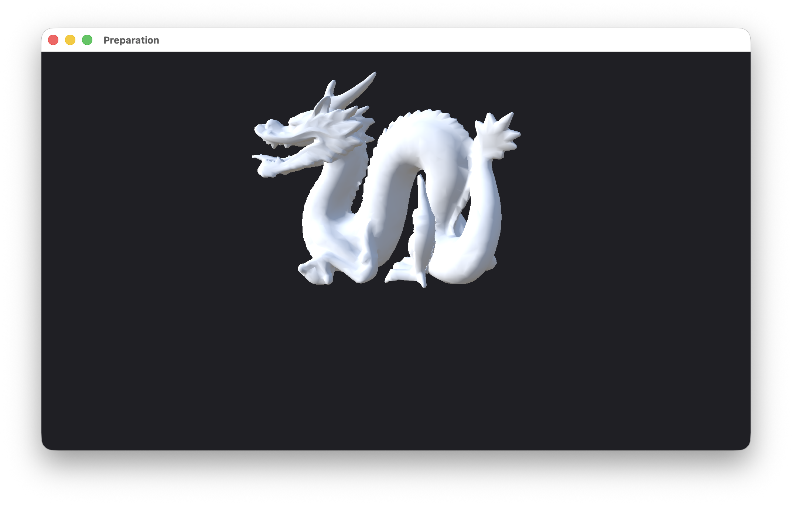

# Préparation au projet OpenGL

**Étudiants :** SEDDI Allan et LETELLIER Aymeric  
**Classe :** E4FI

## Introduction

Ce document explique ce qui a été fait dans le dossier `Preparation/` pour le TP de préparation au projet. Le but était surtout de rassembler les notions vues dans les anciens TD/TP : buffers OpenGL, rendu 3D, matrices, caméra et éclairage.

Le programme affiche le Stanford Dragon avec une caméra orbitale. La caméra est calculée avec une fonction `LookAt`, et le rendu utilise les matrices `Model`, `View` et `Projection`.


Sur cette capture, on voit le rendu final du dragon dans la fenêtre OpenGL. Le fond est volontairement simple pour mieux voir le modèle et l'éclairage.

Les fichiers importants sont :

- `preparation.cpp` : le code principal du TP.
- `shaders/project.vs.glsl` : le vertex shader.
- `shaders/project.fs.glsl` : le fragment shader.
- `common/GLShader.*` : le code fourni/utilisé pour charger les shaders.
- `Makefile` : la compilation.

## Exercice 1.1 - Multiplication de matrices

### Réponse

J'ai ajouté une fonction qui multiplie deux matrices 4x4 :

```cpp
Mat4 Multiply(const Mat4& A, const Mat4& B)
```

Les matrices sont stockées comme OpenGL les attend, c'est-à-dire en colonne-major. Pour accéder à une case, on utilise donc :

```cpp
matrix[col * 4 + row]
```

Le calcul fait la somme habituelle d'une multiplication matricielle :

\[
C_{row,col} = \sum_k A_{row,k} \cdot B_{k,col}
\]

### Explication

Cette fonction sert à pouvoir composer plusieurs transformations dans une seule matrice. Par exemple, au lieu d'envoyer séparément une translation, une rotation et un scale au shader, on peut tout regrouper dans une matrice monde.

L'ordre attendu est :

\[
World = Translation \cdot Rotation \cdot Scale
\]

Comme on utilise des vecteurs colonnes, la transformation la plus à droite est appliquée en premier.

## Exercice 1.2 - World Matrix

### Réponse

Dans le code, la transformation de l'objet est représentée par une seule matrice `u_Model`.

Dans `preparation.cpp`, elle est créée comme une identité :

```cpp
Mat4 model = Identity();
```

Puis elle est envoyée au shader :

```cpp
glUniformMatrix4fv(locModel, 1, GL_FALSE, model.m.data());
```

Dans le vertex shader, on obtient la position monde avec :

```glsl
vec4 worldPos = u_Model * vec4(a_Position, 1.0);
```

### Explication

Ici, le dragon n'a pas besoin d'être déplacé ou tourné pour être visible, donc la matrice `Model` reste l'identité. Mais le code est quand même organisé comme si on avait une vraie matrice monde.

La position passe ensuite dans la chaîne complète :

\[
clipPosition = Projection \cdot View \cdot Model \cdot position
\]

C'est le même principe que dans les TP précédents sur les transformations, mais ici tout est regroupé proprement dans les trois matrices principales.

## Exercice 1.3 - Normal Matrix

### Réponse

J'ai aussi ajouté une matrice spéciale pour les normales :

```cpp
static Mat3 NormalMatrixFromModel(const Mat4& model)
{
    Mat3 m3 = Mat3FromMat4(model);
    return Transpose(Inverse(m3));
}
```

La formule utilisée est :

\[
NormalMatrix = transpose(inverse(mat3(Model)))
\]

Elle est envoyée au shader avec :

```cpp
glUniformMatrix3fv(locNormalMat, 1, GL_FALSE, normalMat.m.data());
```

Et dans le vertex shader :

```glsl
v_Normal = normalize(u_NormalMatrix * a_Normal);
```

### Explication

Une normale n'est pas une position. C'est seulement une direction. Elle ne doit donc pas être transformée exactement comme un sommet.

Dans ce TP, la matrice `Model` est simple, mais j'ai quand même mis la formule correcte. Comme ça, si on ajoute plus tard un scale ou une rotation sur le dragon, les normales resteront cohérentes pour l'éclairage.

## Exercice 2.1 - Fonction LookAt

### Réponse

La fonction `LookAt` a été recodée dans `preparation.cpp` :

```cpp
Mat4 LookAt(const Vec3& position, const Vec3& target, const Vec3& up)
```

Elle commence par construire les trois axes de la caméra :

\[
forward = normalize(position - target)
\]

\[
right = normalize(up \times forward)
\]

\[
up2 = forward \times right
\]

Ensuite, elle calcule la translation inverse avec des produits scalaires :

\[
tx = -dot(position, right)
\]

\[
ty = -dot(position, up2)
\]

\[
tz = -dot(position, forward)
\]

La matrice obtenue est la matrice de vue.

### Explication

Le but de `LookAt` est de placer la scène dans le repère de la caméra. En réalité, on ne déplace pas la caméra dans OpenGL : on transforme tous les objets avec l'inverse de la transformation caméra.

La fonction reconstruit donc une base caméra à partir de :

- la position de la caméra;
- le point regardé;
- le vecteur `up`.

Après ça, la matrice est envoyée au shader avec l'uniform `u_View`.

## Exercice 2.2 - Utilisation de la View Matrix

### Réponse

Dans le vertex shader, la matrice de vue est appliquée après la matrice modèle et avant la projection :

```glsl
gl_Position = u_Projection * u_View * worldPos;
```

Les normales ne sont pas multipliées par `u_View`. Elles utilisent seulement `u_NormalMatrix`.

### Explication

La position d'un sommet suit cet ordre :

1. passage du local vers le monde avec `Model`;
2. passage du monde vers la caméra avec `View`;
3. passage vers l'espace de projection avec `Projection`.

C'est important de ne pas mélanger les normales avec la view matrix ici, car l'éclairage est calculé de manière cohérente avec les normales transformées par la matrice modèle.

## Exercice 3 - Caméra orbitale

### Réponse

J'ai créé une structure `OrbitCamera` avec :

- `target` : le point que la caméra regarde;
- `distance` : la distance entre la caméra et la cible;
- `phi` : l'angle horizontal;
- `theta` : l'angle vertical.

La caméra est placée sur une sphère autour de la cible :

\[
Y = R \cdot sin(theta)
\]

\[
X = R \cdot cos(theta) \cdot cos(phi)
\]

\[
Z = R \cdot cos(theta) \cdot sin(phi)
\]

Une fois la position calculée, la view matrix est obtenue avec :

```cpp
return LookAt(eye, target, up);
```

### Explication

La souris modifie les angles de la caméra :

- déplacement horizontal : changement de `phi`;
- déplacement vertical : changement de `theta`;
- molette : zoom avec la distance.

J'ai aussi limité les valeurs pour éviter les comportements gênants :

- `phi` est ramené entre `-PI` et `PI`;
- `theta` est bloqué pour éviter de retourner la caméra;
- `distance` reste entre une distance minimale et une distance maximale.


Sur cette capture, le dragon est vu avec un autre angle. Cela montre que la caméra tourne bien autour de la cible au lieu de déplacer directement l'objet.

## Exercice 4 - Affichage du dragon

### Réponse

Le modèle utilisé est le dragon fourni dans `Context/DragonData.h`.

Chaque sommet contient 8 flottants :

- 3 pour la position;
- 3 pour la normale;
- 2 pour les UV.

Dans ce TP, j'utilise seulement la position et la normale. Les UV restent dans les données mais ne servent pas, car il n'y a pas de texture.

Le code crée :

- un VBO pour les sommets;
- un IBO pour les indices;
- un VAO pour garder la configuration des attributs.

Le dessin se fait avec :

```cpp
glDrawElements(GL_TRIANGLES, m_IndexCount, GL_UNSIGNED_SHORT, nullptr);
```

### Explication

Cette partie reprend directement les TD sur VBO, IBO et VAO.

Le VBO évite d'utiliser directement un tableau CPU à chaque frame. L'IBO permet de dessiner avec des indices, ce qui est mieux pour un vrai maillage. Le VAO garde les liens entre les buffers et les attributs du shader.

Les deux attributs utilisés sont :

- `a_Position`;
- `a_Normal`.


Cette vue montre que le modèle est bien en 3D et que la caméra peut tourner autour. On voit aussi que la profondeur est bien prise en compte.

## Exercice 5 - Projection perspective, depth test et culling

### Réponse

Le rendu 3D active le depth test et le culling :

```cpp
glEnable(GL_DEPTH_TEST);
glDepthFunc(GL_LEQUAL);
glEnable(GL_CULL_FACE);
glCullFace(GL_BACK);
```

La matrice de projection est calculée à chaque frame avec le ratio de la fenêtre :

```cpp
Perspective(60.0f * pi / 180.0f, aspect, 0.1f, 100.0f);
```

### Explication

Le depth test permet d'afficher les faces dans le bon ordre en fonction de leur profondeur. Sans ça, des triangles derrière pourraient passer devant.

Le back-face culling évite de dessiner les faces arrière. C'est utile pour un maillage fermé comme le dragon.

La projection perspective donne l'effet de profondeur classique : ce qui est loin paraît plus petit.

## Exercice 6 - Éclairage

### Réponse

Le fragment shader utilise d'abord une lumière diffuse de Lambert :

```glsl
float LambertDiffuse = max(dot(N, L), 0.0);
```

Ensuite, il ajoute une ambiance hémisphérique :

```glsl
vec3 hemiAmbient = mix(groundColor, skyColor, t);
```

Puis une correction gamma :

```glsl
vec3 colorSRGB = pow(colorLinear, vec3(1.0 / 2.2));
```

### Explication

La partie diffuse dépend de l'angle entre la normale et la lumière. Si la normale regarde vers la lumière, la zone est claire. Sinon, elle devient sombre.

L'ambiante hémisphérique rend le résultat plus lisible. Les faces orientées vers le haut prennent un peu la couleur du ciel, et les faces vers le bas prennent plutôt la couleur du sol.

La correction gamma évite un rendu trop brutal et donne un résultat plus agréable à l'écran.

### Étapes visuelles de l'éclairage

J'ai gardé trois captures pour montrer l'évolution de l'éclairage.



Avec seulement la diffuse, le relief est visible, mais les zones dans l'ombre deviennent presque noires.



Avec une ambiante constante, on récupère de la lisibilité dans les ombres. Par contre, les zones non éclairées restent assez uniformes.



Avec l'ambiante hémisphérique et le gamma, le rendu final est plus doux. On garde les volumes, mais les ombres sont moins bouchées.

## Intégration finale

La boucle de rendu fait les étapes suivantes :

1. récupération de la taille de la fenêtre;
2. mise à jour du viewport;
3. nettoyage de la couleur et de la profondeur;
4. calcul de la projection;
5. calcul de la view matrix avec la caméra orbitale;
6. calcul de la normal matrix;
7. envoi des uniforms;
8. dessin du dragon.

Le code reste volontairement regroupé dans `preparation.cpp`, car le but était de préparer les notions pour le projet plutôt que de faire une grosse architecture.

## Compilation

Depuis le dossier `Preparation/` :

```bash
make
make run
```

Le binaire généré est :

```bash
bin/preparation
```

## Bilan

Ce TP m'a permis de reprendre les étapes importantes des anciens TD/TP :

- création des buffers OpenGL;
- rendu indexé avec `glDrawElements`;
- projection perspective;
- matrices `Model`, `View`, `Projection`;
- fonction `LookAt`;
- caméra orbitale;
- transformation correcte des normales;
- éclairage diffus et ambiant.

Le rendu final reste simple, mais il valide les points principaux demandés pour la préparation au projet.

## Améliorations possibles

Pour aller plus loin, on pourrait ajouter :

- une vraie transformation `Model` avec rotation ou scale;
- une texture en utilisant les UV du dragon;
- une lumière contrôlable au clavier;
- un mode fil de fer;
- une sauvegarde automatique des captures depuis le programme.
